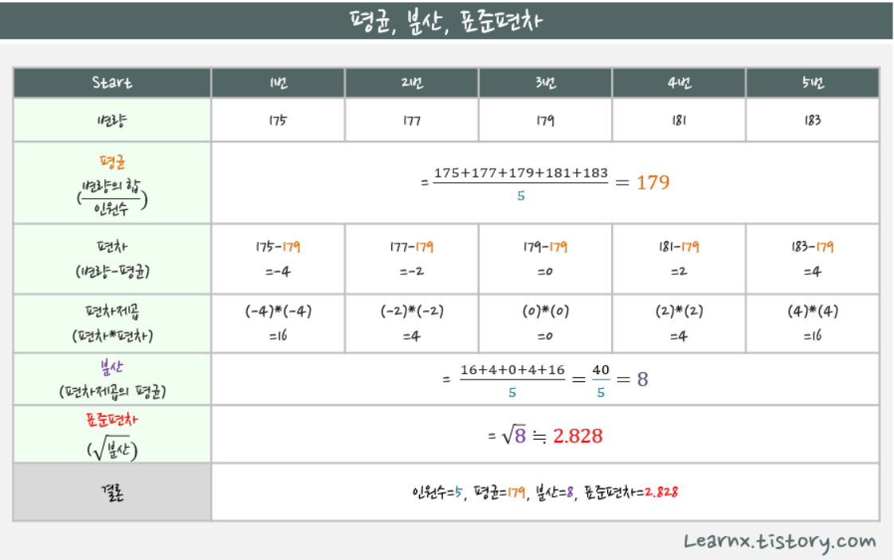

# R day1

## R

#스칼라,벡터,행렬,데이터프레임,리스트

#벡터:데이터 분석에서 자료의 기본형
#스칼라:길이가 1인 벡터

## 벡터

```
# 키,몸무게혈핵형,나이(데이터 순서 중요)(4차원 벡터)
# (170,60,A,30)
# (180,60,A,30)
# (186,60,A,30)
# ...
# (120,60,A,30)
# 
# 
# 50*4 행렬,
# 하나의 벡터를 이루는 데이터의 갯수가 N개이면 N차원 벡터라고함
```

## 벡터 합치기

```
c(벡터,벡터)

#벡터는 동일한 데이터 유형으로 표현됨
n<-c(1,2,3)
cha<-c("x","y","z")

**c(n,cha) #[1] "1" "2" "3" "x" "y" "z" 문자,숫자를 c로 연결하면 문자로 변환
```

## str():벡터 유형 및 구조 확인

```
#str함수:벡터의 유형 및 구조 확인 structure
n<-c(1,2,3)
cha<-c("x","y","z")

str(n) #num [1:3] 1 2 3 #num(numeric):수치

str(cha) #chr [1:3] "x" "y" "z"

#벡터의 길이:3 , 3개의 원소를 갖는 1차원 벡터
```

## length():벡터의 길이

```
n<-c(1,2,3)

length(n) #[1] 3
```

## 상수벡터(letter,month,pi)

```
#상수 벡터
LETTERS #[1] "A" "B" "C" "D" "E" "F" "G" "H" "I" "J" "K" "L" "M" "N" "O" "P" "Q" "R" "S" "T" "U" "V" "W" "X" "Y" "Z"
letters #[1] "a" "b" "c" "d" "e" "f" "g" "h" "i" "j" "k" "l" "m" "n" "o" "p" "q" "r" "s" "t" "u" "v" "w" "x" "y" "z"

month.abb 
#[1] "Jan" "Feb" "Mar" "Apr" "May" "Jun" "Jul" "Aug" "Sep" "Oct" "Nov" "Dec"
month.name
#[1] "January"   "February"  "March"     "April"     "May"       "June"      "July"      "August"    "September" "October"  
#[11] "November"  "December" 

pi #[1] 3.141593

m<-c(12,9,3,5,1)

month.name[1] #[1] "January"
month.name[1,2] #작동 안함 

month.name[c(1,2)] #[1] "January"  "February" c로하나에 벡터로 만들어줘야함

month.name[m] #[1] "December" "September" "March" "May" "January"
```

## <-: 할당해

```
a<-3 #a의 3을 할당

odd<-c(1,3,5)
even<-c(2,4,6)
c(odd,even)

```

## seq: 수열 형성

```
#다양한 증감치를 이용해서 수열 생성
seq(from=3,to=9) #3:9
seq(from=3,to=9, by=0.5) #0.5씩 증가
seq(from=3,to=9, by=0.5)

#수열의 길이를 지정
seq(from=0,to=100,length.out=5)
```

## rep: 수열 반복

```
> ## "a"를 10번 반복
> rep("a", times = 10) 
[1] "a" "a" "a" "a" "a" "a" "a" "a" "a" "a" 

> > ## "1"을 15번 반복
> rep(1, times = 15) [1] 1 1 1 1 1 1 1 1 1 1 1 1 1 1 1   
# 1 은 숫자형 그대로 임 

> > ## ("a" & "1") 을 5번 반복
> rep( c("a", 1), 5) 
[1] "a" "1" "a" "1" "a" "1" "a" "1" "a" "1" 


# "1"이 숫자형이 아니라 문자형으로 변환됨 
> > ## "a"를 먼저 5번 반복하고, "1"을 10번 반복
> rep( c("a", 1), c(5,10)) 
[1] "a" "a" "a" "a" "a" "1" "1" "1" "1" "1" "1" "1" "1" "1" "1" 
```

### each=num: 각원소를 반복

```
rep(c(1,2,3), each=5)#[1] 1 1 1 1 1 2 2 2 2 2 3 3 3 3 3
```

### length.out=num: num길이 만큼 반복

```
rep(1:3, length.out=8)#[1] 1 2 3 1 2 3 1 2 
```

## 벡터 연산

사칙연산 다됨 

**문자에는 사칙연산 적용안됨**

```
#벡터 연산은 원소와 원소끼리 수행
c(1,2,3)+c(4,5,6) #[1] 5 7 9
x<-c(1,2,3)
x*c(4,5,6) #[1] 4 10 18


y<-c(10,20,30)
y/c(2,4,6) #[1] 5 5 5

y%%c(3,5,7) #[1] 3 4 4

y%/%c(3,5,7) #[1] 1 0 2

z<-c(10,20,30,40) 
z/c(2,5)  #[1]  5  4 15  8 #배수에 갯수가 맞으면 연산됨 경고 없이

x<-c(1:3) #길이3
y<-c(4:9) #길이6

x+y #[1]  5  7  9  8 10 12 #길이가긴것에 맞춰서 짧은  벡터를 반복한다 

c(1,3,5)+10 #[1] 11 13 15

c(1,2,3)+c(4,5,6,7,8) #[1]  5  7  9  8 10 #결과는 잘나옴
                      # 경고메시지(들): 
                      # In c(1, 2, 3) + c(4, 5, 6, 7, 8) :
                      # 두 객체의 길이가 서로 배수관계에 있지 않습니다
```


### %%:나눈 나머지

```
10%%3 # 1 나눈나머지
```

### %/%:몫 만

```
10%/%3 #3 몫
```

## 벡터의 bool 연산

```
# ==,!=,<,>,<=,>=,!x,x|y(or) x&y(and) ,isTRUE(x)(x가 TURE인가요?)
```

```
v<-pi
w<-10/3
v==w #[1] FALSE
v!=  #TRUE
v>w  #FALSE
!(v>w) #TRUE

(v==w) | (v<w) #TURE
(v==w) & (v<w) #FALSE
isTRUE(v==w) #FALSE
```

```
x<-c(1,3,5)
y<-c(3,3,3)

x==y #[1] FALSE  TRUE FALSE #벡터 원소 각각을 따짐 파이썬과 차이
x==3 #[1] FALSE  TRUE FALSE
```

### as.numeric:논리값->숫자로변경

```
#r은 true는 1, false는 0으로 간주
as.numeric(TRUE) # 1 #논리값 ->숫자로 변환
as.numeric(FALSE)# 0

TRUE+TRUE #2
FALSE+FALSE #0
FALSE+TRUE #1
FALSE*TRUE #0
TRUE*TRUE #1
```

### any(),all():하나라도,모두

```
# any함수:논리값이 하나라도 TRUE이면 결과가 TRUE 
# all함수:논리값이 모두 TRUE이면 결과가 TRUE 

a<--3:3
a #[1] -3 -2 -1  0  1  2  3
a>0 #[1] FALSE FALSE FALSE FALSE  TRUE  TRUE  TRUE

any(a>0) #TRUE
all(a>0) #FALSE
```

## sum():합계

```
x<-c(0,25,50,75,100)
sum(x>50) #2  75 100만 TRUE
(x>50) #FALSE,FALSE,FALSE,TRUE,TRUE
>:이건 bool연산이므로  FALSE=0,TRUE=1
그러므로 합은 2

sum(1:5) #15
sum(1,2,3) #6
sum(1:2,3:5)#15
sum(TRUE,FALSE,TRUE)#2
```

## sqrt():제곱근,2!=(sqrt(2))^2

```
#2의 제곱근의 제곱 =>2, r에서는 정확하게 2가아님(부동소수점수 연산)
sqrt(2)

sqrt(2)^2 #2

sqrt(2)^2==2 #FALSE

sqrt(2)^2-2 #[1] 4.440892e-16
```

## all.equal():약간의 오차는 무시하고 참불 가려줘

```
all.equal(sqrt(2)^2,2)#TRUE #약간의 오차를 무시하므로,두값이 값다고 출력

```

## 문자벡터를 합치기

```
fruits+food #Error in fruits + food : 이항연산자에 수치가 아닌 인수입니다

paste(fruits,food)#[1] "Apple Pie"       "Banana Juice"    "Strawberry Cake"

paste(fruits,"juice") #[1] "Apple juice"      "Banana juice"     "Strawberry juice"

```

## abs():절대값

```
#절대값
x<- -3:3
abs(x)
```

## log():로그값

```
#로그값 : log함수는 밑수가 기본적으로 e(2.718..)인 자연로그
log(1:5) #[1] 0.0000000 0.6931472 1.0986123 1.3862944 1.6094379


##base=,를 이용해 밑수 설정 가능
log(1:5,base=3) #밑수가 3인 로그

log(1:5,base=2)
log2(1:5) #로그 2,5는 따로 함수로 있음

log(1:10,base=10)
log10(1:10)
```

## exp(x):e^x

```
exp(1:5)#[1]   2.718282   7.389056  20.085537  54.598150 148.413159

y<-exp(1:5)

log(y) #[1] 1 2 3 4 5 

기본적으로 로그e이므로 exp가 사라짐
```

## factorial(x):x!

```
factorial(1:5) #[1]   1   2   6  24(4!) 120(5!)

각 요소에 팩토리가 붙음
```

## choose(5,2):5C2

```
choose(5,2) #5개 중에서 2개를 선택하는 경우의 수, 5C2
#nCr=n!/(r!*(n-r)!)=>120/12 =>10
```

## option("digits"):유효숫자는어디까지?

```
#유효자릿수 확인 및 설정
options("digits") #7 #현재 유효숫자는어디까지인가?
```

## signif():유효숫자 설정

````
signif(456.789, digits=2) #460
signif(456.789, digits=3) #457
signif(456.789, digits=4) #456.8
````

## round():반올림,소숫점

```
#반올림:소숫점
round(456.789, digits=1) #[1] 456.8
round(456.789, digits=2) #[1] 456.79
round(456.789, digits=3) #[1] 456.789


#1~10까지 수에 대한 각각의 제곱근을 구한다음 소수이하 2자리 까지 출력

round(sqrt(1:10),digits=2)
#[1] 1.00 1.41 1.73 2.00 2.24 2.45 2.65 2.83 3.00 3.16
round(sqrt(1:10),2)

round(456.789, digits=1) 
round(456.789, digits=-1) #460
round(456.789, digits=-2) #500

#반올림 숫자가 5인 경우에는 가까운 짝수로 반올림
round(11.5) #12
round(12.5) #12
round(12.51) #13
```

### floor,ceiling,trunc

```
# floor:작은 가까운 정수로 반올림
# ceiling: 큰 가장 가까운 정수로 반올림
# trunc:0에 가까운 정수로 반올림

floor(456.78) #456
floor(-456.75)#-457

ceiling(456.78) #457
ceiling(-456.78)#-456

trunc(456.78) #456
trunc(-456.78)#-456
```

## Inf:무한대

```
3/0 #Inf infinity
5-Inf#-Inf
Inf*Inf #Inf
Inf*(-Inf)#-Inf

```

### is.infinite():무한대야??

```
#r에서는 1.8*10의 308승까지 표현가능 그보다 크면 무한대로나옴

is.infinite(10^306) #FALSE

is.infinite(10^309) #TURE
is.infinite(10^(306:310))#[1] FALSE FALSE FALSE  TRUE  TRUE
```

## NaN:Not a Number:숫자가 아님 계산결과정의 불가

```
Inf/Inf# NaN #계산 정의 불가
Inf*0# NaN
log(-2)# NaN
NaN+3# NaN
is.nan(Inf*0)#Ture
```

## NA:not Available,결측값: 값이 없음

```
NA에 먼 짓을 해도 NA임
k<-NA
k+2 #NA
sqrt(NA)#NA
```

## prod():요소값을 다 곱

```
z<-1:5
prod(z) #120 #요소값을 다곱하기
```

## min(),max():최대 최소

```
z<-1:5
min(z) #1
max(z) #5
```

## mean():평균

```
z<-1:5
mean(z) #5.5
```

## median():중위값

```
z<-1:5
median(z) #3
```

## var():분산,sd():표준편차



## range():범위

```
z<-1:5
range(z) #[1] 1 5
```

## sum(z,na.rm=TRUE):NA빼고 연산해줘,na.omit

```
sum(z,na.rm=TRUE) #15 #NA는 빼고 연산해라
sum(na.omit(z)) #15
```

## cunsum():누적합

```
traffic.death<-c(10,20,30,20)
cumsum(traffic.death) #[1] 10 30 60 80


traffic.death<-c(10,20,NA,30,20)
cumsum(traffic.death) #[1] 10 30 NA NA NA
```

## diff():(n+1)-(n)

```
diff(1:10) #[1] 1 1 1 1 1 1 1 1 1

```

### lag=3 :세번째 떨어진 요소끼리 diff 실행

```
diff(1:10, lag=3)# [1] 3 3 3 3 3 3 3 #3칸 떨어진 원소간의 차를 구함
```

## union,intersect,setdiff():합,교,차집합

```
p<-1:10
q<-6:15
# 두벡터에 대한 합집합
union(p,q)#합집합
intersect(p,q)#교집합
setdiff(p,q)#차집합
```

## setequal(x,y):x,y집합이 같음?

```
p<-1:10
q<-6:15

setequal(p,q) #FALSE
```

## is.element(확인할값,벡터):값이 벡터안에 있나요?

```
is.element(3,1:5) #TRUE

is.element(6,1:5) #FALSE

is.element(4:7,1:5)#[1]  TRUE  TRUE FALSE FALSE
```

## 인텍싱:vector[]

```
num<-0:30
num

num[5] #4
num[5:10]#[1] 4 5 6 7 8 9


num[c(2,5,10,27)]#[1]  1  4  9 26

prime<-c(2,3,5,7,11,13)
idx<-c(1,3,5)
prime[idx]#[1]  2  5 11
prime[3:5]

prime[-3] # [1]  2  3  7 11 13 #3번 인덱스 제외

prime[-2:-4]#[1]  2 11 13
prime[-(2:4)]# 위와 같음


prime<-c(2,3,5,7,11,13)
length(prime)

prime[1:(length(prime)-2)]

prime[-length(prime)]

prime[2]<-30 #[1]  2 30  5  7 11 13
prime

prime[c(3,4)]<-c(30,40) #[1]  2 30 30 40 11 13
prime

```

## 표준화

```
# 5. 변수 x에 1~10까지 값을 할당하고 이 값들을 평균0과 표준편차1로 표준화하시오.
# 
# 표준화= (각 data - 전체 data평균)/전체 data표준편차)           
           
x<-c(1:10)
           
sd(x)    

(x-mean(x))/sd(x)     
```

