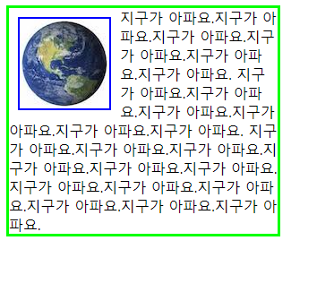
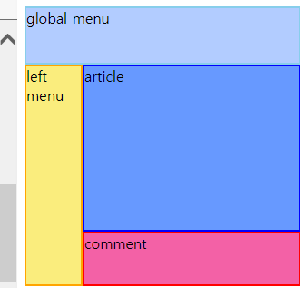

# CSS2(속성)

## hover,focus 

```
<html>
<head>
    <meta charset="UTF-8">
    <style>
        .box{background-color:#09c;}
        .hover-box:hover{background-color:orange;}
        .focus-input:focus{background-color:yellow;}

    </style>
</head>
<body>
<div class="box hover-box ">마우스를 올려주세요</div>
<input type="text" value="click me" class="focus-input">
</body>


focus는 클릭시 색이 변하고
hover는 마우스를 올리면 색이 변함
```

## margin,padding

```

<!--마진:바깥쪽(상우하좌) 여백
4개일때 위 오른 아래 왼 
3개일때 위 좌우 아래
2개 일때 상하 좌우


padding도 똑같이 적용됨

패딩:안쪽 여백-->

<html>
<head>
    <meta charset="UTF-8">
    <style>
	.box-container{
		background-color: #d2f4ff;
		border: 2px solid #0000ff;
		margin: 5px 15px;
	}
	.box-container div{
		width: 120px;
		height: 80px;
		background-color: #fde6ff;
		border: 2px solid #90C;
		font-size: 15px;
	}
	#box1{ margin: 10px;  padding: 0; }
	#box2{ margin: 5px 25px; padding: 0; }
	#box3{ margin: 0;  padding: 10px 30px 5px; }
	#box4{ margin: 10px; padding: 10px 20px; }
	#box5{ margin: 10px 30px 0 50px; padding: 30px 0 }    </style>
</head>
<body>
	<div class="box-container">
		<div id="box1">m: 10<br>p: 0</div>
	</div>
	<div class="box-container">
		<div id="box2">m: 5 25<br>p: 0</div>
	</div>
	<div class="box-container">
		<div id="box3">m: 0<br>p: 10 30 5</div>
	</div>
	<div class="box-container">
		<div id="box4">m: 10<br>p: 10 20</div>
	</div>
	<div class="box-container">
		<div id="box5">m: 10 30 0 50<br>p: 30 0</div>
	</div>
</body>
</html>


```

### margin-top,left,bottom,right

```
한곳에만 마진을 주고 싶을때 
```


## font

```
<html>
<head>
    <meta charset="UTF-8">
    <style>
        #text1 {font-size:40px}
        #text2 {font-size:30px}
        #text3 {font-size:20px}
        .bold{font-weight:bold}
        .italic{font-style:italic}
        .jinji{font-family:"궁서"}
        #text4{font: italic bold 50px serif;} #한번에 적용
        ## 이탤릭(기울임) (bold)굵은 50px크기에 serif체 글씨

    </style>

</head>
<body>
<div id="text4">반갑습니다 nice to meet you</div>
<div id="text1"> 40픽셀</div>
<div id="text2"> 30픽셀</div>
<div id="text3"> 20픽셀</div>
<div class="bold">굵은</div>
<div class="italic">이탤릭</div>
<div class="jinji">궁서</div>


</body>

</html>
```


## color

```
<html>
<head>
    <meta charset="UTF-8">
    <style>

    </style>

</head>
<body>
    <div style="color:red">text1</div>
    <div style="color:#ff0000">text2</div>
    <div style="color:#f00">text3</div>
    <div style="color:rgb(255,0,0)">text4</div>
    <div style="color:rgba(255,0,0,1)">text5</div> 본래
    <div style="color:rgba(255,0,0,0.5)">text6</div> 투명도 0.5
    <div style="color:rgba(255,0,0,0)">text7</div> 완투명
###전부빨간색
<!--a는 알파(alpha), 알파는 불투명도 속성-->

</body>

</html>

```


## align 정렬

```
<html>
<head>
    <meta charset="UTF-8">
    <style>
        #align1{text-align:right;}
        #align2{text-align:lefg;}
        #align3{text-align:center;}

    </style>

</head>
<body>
<div id="align1">오른쪽</div>
<div id="align2">왼쪽</div>
<div id="align3">가운데</div>
</body>

```

## background-image

```
</html>


<html>
<head>
    <meta charset="UTF-8">
    <style>
    #box1-1{background-color:green;}
    #box1-2{background-color:ff00ff;width:200px}
    #box2-1{width:100px;height:100px;background-image:url("earth.jpg");}
        #box2-2{width:300px;height:200px;margin:50px;background-image:url("earth.jpg");}


    </style>

</head>
<body>
<div id="box1-1">상자1</div>
<div id="box1-2">상자2</div>
<div id="box2-1"></div>
<div id="box2-2"></div>

</body>

</html>

```

## background-repeat

```
<html>
<head>
    <meta charset="UTF-8">
    <style>
        .abox{
        widit:500px;
        height:300px;
        background-image:url("earth.jpg");
        margin-bottom:20px;
        border:2px solid orange
        }
        #box1{background-repeat:no-repeat}
        #box2{background-repeat:repeat}
        #box3{background-repeat:repeat-x} #x축만 반복
        #box4{background-repeat:repeat-y} #y축만 반복


    </style>

</head>
<body>
<div class="abox"></div>
<div class="abox" id="box1"></div>
<div class="abox" id="box2"></div>
<div class="abox" id="box3"></div>
<div class="abox" id="box4"></div>


</body>

</html>
```

## background-position

```
background-position:30px 10px #상하 30 좌우10

background-position:right 30px #좌우는 오른쪽 상하는30px

```

## border

```
<html>
<head>
    <meta charset="UTF-8">
    <style>
        .border-styles >p{
            margin:2px;
            padding:10px;
            border-color:#ff0000;
            border-width:5px;
            }
        .box{
        width:100px;
        height:100px;
        background-color:skyblue;
        }
        #boxh{visibility:hidden}
        #boxv{visibility:visible}

    </style>

</head>
<body>
<div class="box" id="boxh"></div>
<div class="box" id="boxv"></div>


<div class="border-styles">
    <p style="border-style:solid">solid</p>
    <p style="border-style:dotted">dotted</p>
    <p style="border-style:dashed">dashed</p>
    <p style="border-style:double">double</p>
    <p style="border-style:groove">groove</p>
    <p style="border-style:ridge">ridge</p>
    <p style="border-style:inset">inset</p>
    <p style="border-style:outset">outset</p>

</div>

</body>

</html>
```

## 사진옆에 문자를 넣고 싶을 때




```
<html>
<head>
    <meta charset="UTF-8">
    <style>
        .float-container{
        width:300px;
        border:3px solid #0f0;
        }
    .float-container img{
    float:left;
    margin:10px;
    border:2px solid #00f;
    </style>

</head>
<body>
<div class="float-container">
    
    지구가 아파요.지구가 아파요.지구가 아파요.지구가 아파요.지구가 아파요.지구가 아파요.
    지구가 아파요.지구가 아파요.지구가 아파요.지구가 아파요.지구가 아파요.지구가 아파요.
    지구가 아파요.지구가 아파요.지구가 아파요.지구가 아파요.지구가 아파요.지구가 아파요.
    지구가 아파요.지구가 아파요.지구가 아파요.지구가 아파요.지구가 아파요.지구가 아파요.
</div>

</body>

</html>
```


## cursor

```
    <style>
    .cursors span{
    background-color:#ffff00;
    border:2px solid #09c;
    </style>

</head>
<body>
<div class="cursors">
    <span style="cursor:crosshair">crosshair</span> 에임모양
    <span style="cursor:pointer">pointer</span> 손모양
    <span style="cursor:move">move</span> 사방면
    <span style="cursor:e-resize">e-resize</span>
    <span style="cursor:crosshair">crosshair</span>
    <span style="cursor:wait">wait</span>


</div>


마우스 커서에 변화를 준다
```

## 퀴즈




```
<html>
<head>
    <meta charset="UTF-8">
    <style>
        .box{
        width:300px;
        height:300px;
        }


        #global{
        width:300px;
        height:60px;
        border:2px solid skyblue;
        background-color:#B2CCFF;}

        #left{
        width:60px;
        height:240px;
        border:2px solid orange;
        background-color:#FAED7D;
        float:left;}

        #article{
        width:236px;
        height:180px;
        border:2px solid blue;
        background-color:#6799FF;
        margin-left:64px;
        }

        #comment{
        width:236px;
        height:56px;
        border:2px solid red;
        background-color:#F361A6;
        margin-left:64px;}

    </style>

</head>
<body>
<div class="box">
    <div id="global">global menu</div>
    <div id="left" >left<br>menu</div>
    <div id="article">article</div>
    <div id="comment">comment</div>
</div>
</body>

</html>
```


