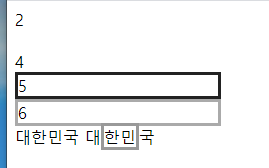
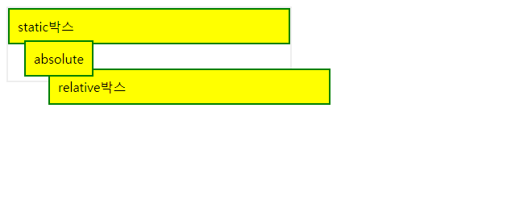

# ccs3

## w



```
<!DOCTYPE html>
<html lang="en">
<head>
    <meta charset="UTF-8">
    <style>
        .disp-none{display:none}
        .invisible{visibility:hidden}
        .block1{width:200px;border:3px solid #222}
        .block2{width:200px;border:3px solid #aaa}
        .inline1{background #09c;}
        .inline2{border:3px solid#999;}
        .inline-block1{background #09c;;display:inline-block;height:50px;}
        .inline-block2{border:3px solid#999;;display:inline-block;width:50px}        
        
        

    </style>
</head>
<body>
<!--눈에 안보이게 함-->
<div class="disp-none">1</div>
<div>2</div>
<div class="invisible">3</div>
<div>4</div>

<!--block태그(줄바꿈) :div,h,li,p태그-->
<div class="block1">5</div>
<div class="block2">6</div>


<!--inline태그(줄바꿈 하지 않음):a,i,b,span태그-->
<!--범위를 설정 할수 없음 width나 height적용이 안됨-->
대<span class="inline1">한민</span>국
대<span class="inline2">한민</span>국

</body>
</html>
```

## position



```
        .box-container{
        width:350px;border:2px solid #eeeeee;
        }
        .box-container div{
        padding:10px;border:2px solid green; background-color:yellow;
        }

       #box1{position:static; top:50px;left:30px;}
       #box2{position:relative; top:30px;left:50px;} 본래의 것에서 값만큼 상대적 위치
       #box3{position:absolute; top:50px;left:30px;} 겹치든 말든 값에 맞게 위치

   </style>
</head>
<body>
<div class="box-container">
    <div id="box1">static박스</div>
    <div id="box2">relative박스</div>
    <div id="box3">absolute</div>


</div>

```

