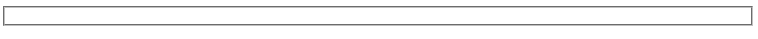
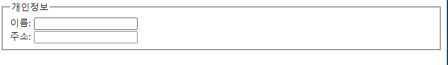
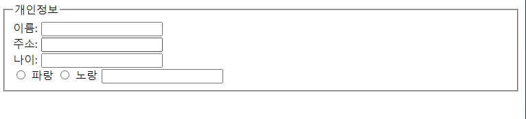
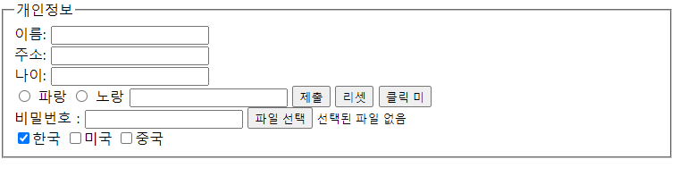
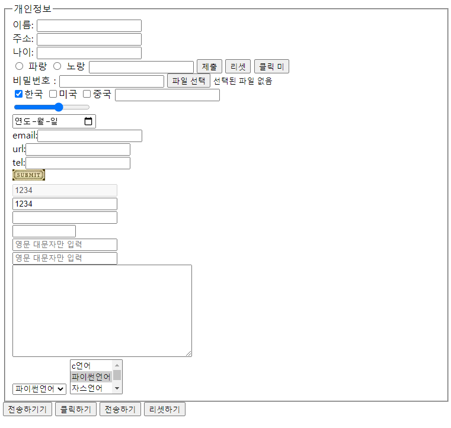

# js6

## form태그

### method 

```
<body>
<form action="실행 app의 위치(주소)" method="get" name="" >
<!-- method 두가지 get,post
   웹페이지에 전송하는 방식
   get 방식:www.aaa.com?id=F3F2...&addr=%F3...(암호화 없이 전송 대신 빠름,용량이 너무 크면    못보냄)
   post 방식:암호화를 거치고 포장해서 전송,상대적으로 용량에 제한이 없다.

```

### fieldset 폼요소를 그룹으로 묶음



### legend :fieldset에 제목, label:fieldset에 내부에 작성



```
<form>    
    <fieldset> <!--폼 내의 요소들을 그룹으로 묶어주는 코드-->
        <legend>개인정보</legend>
<!--        입력상자와 라벨에 연결을 묵시적으로 함-->
        <label>이름: <input type="text"></label><br>
        <!--레이블:분류결과(데이터 모뎉->예측 결과(pass/fail)-->
        <label>주소: <input type="text"></label><br>
 <form>  
```

### 라벨 묵시적연결과 명시적 연결



```
    <fieldset> <!--폼 내의 요소들을 그룹으로 묶어주는 코드-->
        <legend>개인정보</legend>
<!--        입력상자와 라벨에 연결을 묵시적으로 함--> 
        <label>이름: <input type="text"></label><br>
        <!--레이블:분류결과(데이터 모뎉->예측 결과(pass/fail)-->
        <label>주소: <input type="text"></label><br> 
  			//input을 라벨내부에 넣음으로써 이름:부분을 눌러도 text상자에 커서가 생김
        
        <!--        입력상자와 라벨을 연결하지 않음 나이:를 눌러도 커서 안생김-->
        <label>나이: </label>
        <input type="text"/><br>

        <!-- 2)입력상자와 라벨을 연결을 id로 명시적(explicit)으로 함 동일한 id를 줌으로써 라벨과 입력상자를 연결시킴-->
        <input type="radio" name="color-select" id="abc" value="blue" >
        <label for="abc">파랑 </label>
        <input type="radio" name="color-select" id="def" value="yellow" >
        <label for="def">노랑</label>
        <input type="text">
```

### 폼 안에 작성된 내용을 서버로 전송하라

#### 파일선택 박스와 체크가 된 체크박스 만들기



```
<form>    
    <fieldset> <!--폼 내의 요소들을 그룹으로 묶어주는 코드-->
        <legend>개인정보</legend>
<!--        입력상자와 라벨에 연결을 묵시적으로 함-->
        <label>이름: <input type="text"></label><br>
        <!--레이블:분류결과(데이터 모뎉->예측 결과(pass/fail)-->
        <label>주소: <input type="text"></label><br>

        <!--        입력상자와 라벨을 연결하지 않음-->
        <label>나이: </label>
        <input type="text"/><br>

        <!--       2)입력상자와 라벨을 연결을 id로 명시적(explicit)으로 함-->
        <input type="radio" name="color-select" id="abc" value="blue" >
        <label for="abc">파랑 </label>
        <input type="radio" name="color-select" id="def" value="yellow" >
        <label for="def">노랑</label>
        <input type="text">

<!--        폼 안에 작성된 내용을 서버로 전송하는 역할을 담당-->
        <input type="submit">
        <input type="reset" value="리셋">

        <input type="button" value="클릭 미" onclick="처리함수"><br>
        비밀번호 : <input type="password">
        <input type="file" accept="image/jpeg"><br> 

        <input type="checkbox" name="nation" value="kor" checked="checked">한국
        <input type="checkbox" name="nation" value="usa">미국
        <input type="checkbox" name="nation" value="chn">중국

    </fieldset>
```

#### radio와 check박스에 차이

```
같은 아이디로 묶여 있는 것들을 
radio는 하나만 선택 가능

check 박스는 다중 선택이 가능하다
```

### 여러가지 input태그



```
<form>    
    <fieldset> <!--폼 내의 요소들을 그룹으로 묶어주는 코드-->
        <legend>개인정보</legend>
    <!--입력상자와 라벨에 연결을 묵시적으로 함-->
        <label>이름: <input type="text"></label><br>
        <!--레이블:분류결과(데이터 모뎉->예측 결과(pass/fail)-->
        <label>주소: <input type="text"></label><br>

        <!--        입력상자와 라벨을 연결하지 않음-->
        <label>나이: </label>
        <input type="text"/><br>

        <!--       2)입력상자와 라벨을 연결을 id로 명시적(explicit)으로 함-->
        <input type="radio" name="color-select" id="abc" value="blue" >
        <label for="abc">파랑 </label>
        <input type="radio" name="color-select" id="def" value="yellow" >
        <label for="def">노랑</label>
        <input type="text">

     <!--폼 안에 작성된 내용을 서보로 전송하는 역할을 담당-->
        <input type="submit">
        <input type="reset" value="리셋">

        <input type="button" value="클릭 미" onclick="처리함수"><br>
        비밀번호 : <input type="password">
        <input type="file" accept="image/jpeg"><br>

        <input type="checkbox" name="nation" value="kor" checked="checked">한국
        <input type="checkbox" name="nation" value="usa">미국
        <input type="checkbox" name="nation" value="chn">중국
        <input type="number"><br>
        <input type="range" min="5" max="10"><br>
        <input type="date"><br>
        email:<input type="email"><br><!--제출시 이미일 형식을 지키게 해줌-->
        url:<input type="url"><br><!--제출시 url 형식을 지키게 해줌-->
        tel:<input type="tel"><br><!--숫자 형식을 지키게 해줌-->
        <input type="image" src="btn.jpg"><br>
        <input type="text" value="1234" disabled="disabled"><br><!--textbox는 보여주지만 비활성화 수정은 안되요-->
        <input type="text" value="1234" readonly="readonly"><br><!--위랑 같지만 비활성화까진 안되있음-->
        <input type="text" ><br><!--23글자정도가 입력한계-->
        <input type="text" size="10"><br><!--text상자 크기 조절-->
        <input type="text" placeholder="영문 대문자만 입력"><br><!--상자에 커서올리면 사라지는 글을 넣음-->
        <input type="text" pattern="[A-Z]+" placeholder="영문 대문자만 입력"><br><!--진짜 대문자만 넣고싶으면 정규표현식을 사용-->
        <textarea rows="10" cols="40" maxlength="10"></textarea><br> <!--원하는 크기에 텍스트상자를 만들수 있다 글자수 제한도 할 수있음-->
        <select>
            <option value="c">c언어</option>
            <option value="py" selected>파이썬언어</option>
            <option value="js">자스언어</option>

        </select>

        <select multiple size="3">
            <option value="c">c언어</option>
            <option value="py" selected>파이썬언어</option>
            <option value="js">자스언어</option>
            <option value="c">c언어</option>
            <option value="py" selected>파이썬언어</option>
            <option value="js">자스언어</option>
        </select>


    </fieldset>

    <input type="button" value="전송하기">
    <button type="button">클릭하기</button>
    <button type="submit">전송하기</button>
    <button type="reset">리셋하기</button>
</form>       
   <!--서버로 폼 내용 전송시, 버튼과 서브밋에 방식 차이
    서비밋:곧바로 서버에 폼내용을 전송
    버튼:자바스크립트 함수를 호출->함수 내에서 유효성 검증->검증 수행후 전송-->
    

```

## 내 계산기 만들기

```

```